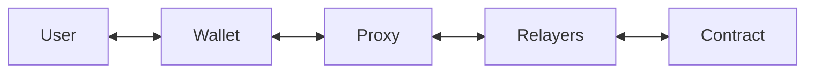
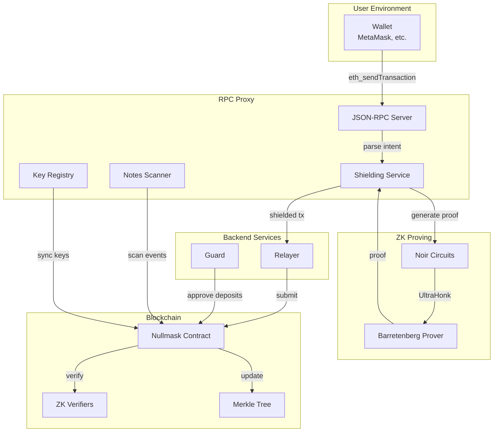

# System Overview

Nullmask's architecture consists of several interacting components that together enable privacy-preserving transactions on EVM chains.

## Architecture Diagram

## Data Flow

1. **User signs** a standard EIP-1559 transaction in their wallet
2. **Proxy intercepts** the RPC call and parses the user's intent
3. **Shielding service** selects funding notes and prepares circuit inputs
4. **Noir circuits** generate a ZK proof via the Barretenberg prover
5. **Relayer** submits the proof and public inputs to the smart contract
6. **Contract** verifies the proof, spends nullifiers, and adds new note commitments to the Merkle tree
7. **Notes scanner** monitors chain events and decrypts new notes for the user
