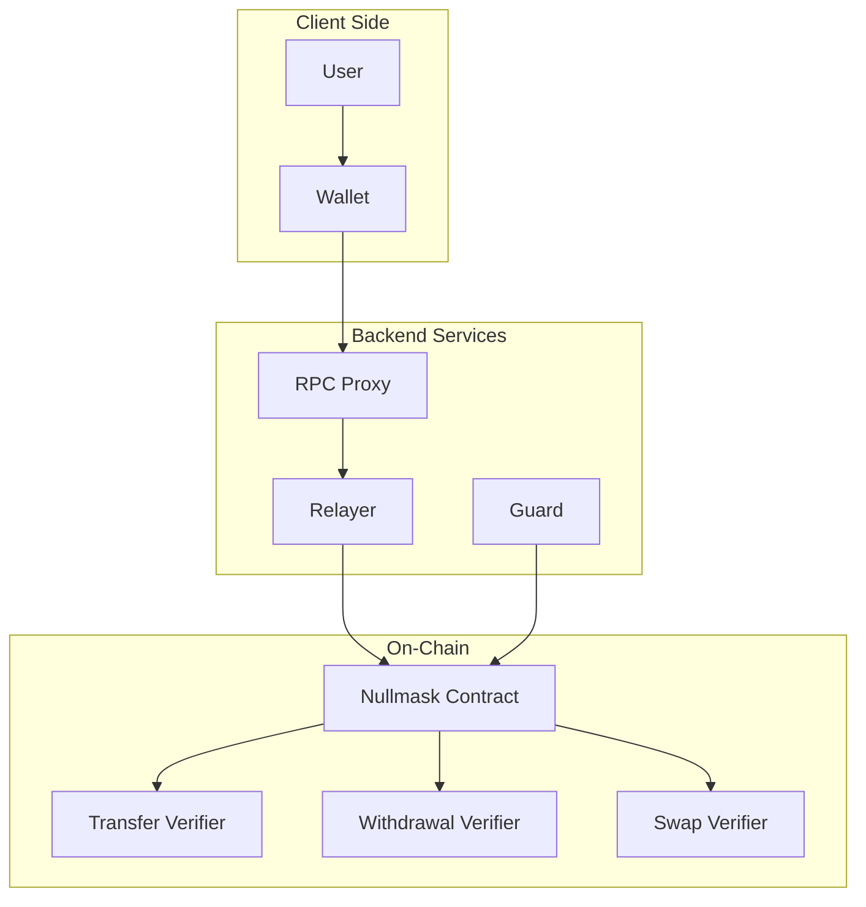

# Components

## Overview

Nullmask consists of four main components that work together to provide privacy-preserving transactions.

## Wallet

Any standard EVM wallet that supports:

* **Custom networks** (custom RPC endpoints)
* **`personal_sign`** method (for key generation)
* **EIP-1559** transactions

## RPC Proxy

The core orchestration service. It sits between the wallet and the blockchain, intercepting JSON-RPC calls.

**Responsibilities:**

* **Key management** — Generates viewing keys and receiving keys from wallet signatures; stores them locally
* **Transaction shielding** — Parses transaction intent, selects funding notes, generates ZK proofs
* **Balance tracking** — Scans the blockchain for new notes, trial-decrypts them, maintains shielded balances
* **State isolation** — Per-user state via access tokens (HTTP-only cookies)
* **Key registry sync** — Caches on-chain receiving keys for privacy-preserving lookups

**Key internal services:**

| Service            | Purpose                                              |
| ------------------ | ---------------------------------------------------- |
| ShieldingService   | Orchestrates proof generation and relayer submission |
| NoteTreeService    | Manages the local Merkle tree for membership proofs  |
| NotesScanner       | Scans blockchain events for incoming notes           |
| NotesStorage       | Per-user encrypted note storage (LMDB)               |
| KeyStorageService  | Per-user key storage                                 |
| KeyRegistryService | Syncs on-chain receiving key registry                |
| AccessTableService | Maps access tokens to account addresses              |

## Relayer

Executes shielded transactions on behalf of users.

**Responsibilities:**

* Receives shielded transaction data (proof + public inputs) from the proxy
* Submits transactions to the Nullmask contract
* Pays gas fees (reimbursed from the transaction's fee allocation)
* Hides the sender's IP address and identity

The relayer never sees the transaction contents — it only forwards the opaque proof and public inputs.

## Guard

Approves or rejects deposits entering the privacy pool.

**Responsibilities:**

* Monitors pending deposits on the contract
* Screens depositing addresses using chain analysis tools
* Approves legitimate deposits (adds note commitments to the Merkle tree)
* Rejects flagged deposits (refunds the depositor)
* Publishes revocation keys with each approved deposit

## Smart Contract (Nullmask.sol)

The on-chain privacy pool. Deployed behind a UUPS proxy for upgradeability.

**Responsibilities:**

* Verifies ZK proofs using on-chain verifier contracts
* Manages the note commitment Merkle tree (LeanIMT with Poseidon2)
* Tracks spent nullifiers (note nullifiers and transaction nullifiers)
* Holds deposited funds (ETH and ERC-20 tokens)
* Executes Uniswap V2 swaps during shielded swap operations
* Maintains a key registry for receiving key registration
* Manages token whitelist
