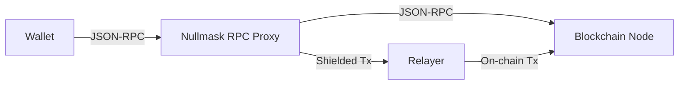

# Virtual Network

## Concept

Nullmask introduces itself to the user's wallet as a **virtual private EVM network**. This is not a real blockchain — it is a mechanism that places a custom RPC proxy between the wallet and the actual blockchain node.

When the user adds the Nullmask network to their wallet, they are configuring the wallet to send all RPC requests to the Nullmask proxy server instead of directly to a blockchain node.

## Why a Virtual Network?

The virtual network approach solves the fundamental UX problem of privacy protocols:

| Approach                       | Requires                             | User Experience                    |
| ------------------------------ | ------------------------------------ | ---------------------------------- |
| Dedicated wallet (Railgun)     | New wallet, new seed phrase          | Poor — fragmented experience       |
| Web app (Tornado Cash)         | Browser interaction, note management | Moderate — extra steps             |
| SDK integration (Kohaku)       | Wallet code changes                  | Blocked — requires wallet adoption |
| **Virtual network (Nullmask)** | Add network to existing wallet       | Seamless — no behavior change      |

## How It Works

### Adding the Network

During onboarding, the user's wallet is prompted to add a new network with:

* **Network Name**: Nullmask (or chain-specific name)
* **RPC URL**: The proxy server URL with an embedded access token
* **Chain ID**: A virtual chain ID (e.g., 43615 for Ethereum Mainnet)
* **Currency Symbol**: ETH (same as the underlying chain)

All these parameters are preconfigured by the app — the user only confirms a wallet dialog.

### Transaction Interception

When the user sends a transaction on the Nullmask network:

1. The wallet constructs and signs a standard EIP-1559 transaction
2. The wallet sends `eth_sendTransaction` (or `eth_sendRawTransaction`) to the proxy
3. The proxy detects it as a value transfer and shields it:
   * Translates 0x address to shielded address
   * Generates a ZK proof
   * Submits via the relayer
4. The proxy returns a transaction status to the wallet

### Balance Queries

When the wallet queries `eth_getBalance` or ERC-20 `balanceOf`:

1. The proxy intercepts the call
2. Instead of querying the blockchain, it returns the user's **shielded balance** from local note storage
3. The wallet displays the shielded balance as if it were a normal balance

### Access Token

Unlike a traditional RPC node where all data is public, the Nullmask proxy must restrict data access. An access token is embedded in the RPC URL and stored as an HTTP-only cookie. This token:

* Derives from the user's ECDSA signature (deterministic)
* Isolates each user's private data (keys, notes, transactions)
* Persists across sessions via secure cookies

## Local vs Remote Deployment

The proxy can run in two modes:

### Remote Server

* Accessed via a web page (the default deployment)
* Full on-chain privacy is maintained
* The server operator can observe user transfers
* No installation required

### Local Device

* Runs on the user's mobile device or as a browser extension
* Full privacy — no third party sees transfers
* Requires installation
