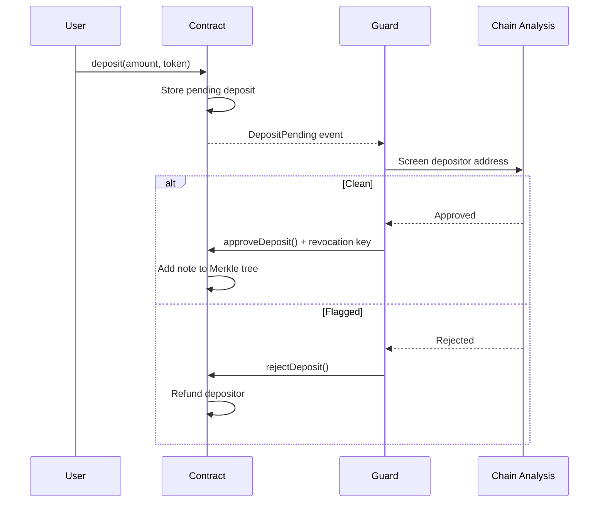

# Deposit Screening

Nullmask employs deposit screening to prevent illicit funds from entering the privacy pool.

## How It Works

Every deposit to the Nullmask contract must be verified and approved by the guard service before the deposited funds become available as shielded notes.

## Screening Criteria

The guard service uses chain analysis tools to evaluate:

* Whether the depositing address is associated with known illicit activity
* Whether the funds originate from sanctioned entities
* Whether the deposit patterns indicate an attempt to disguise the origin of funds

## Expedited Approval

Deposits originating from well-established centralized exchanges receive expedited approval, since CEXs are responsible for:

* Collecting user KYC data
* Rejecting illicit funds at the point of entry

## Rejected Deposits

If a deposit is rejected:

* The deposited funds are refunded to the original depositor
* The gas escrow is paid to the guard
* No note is created in the Merkle tree

## User-Initiated Withdrawal

Users can withdraw pending deposits at any time before guard action:

* Call `withdrawPendingDeposit()` on the contract
* Both deposit amount and gas escrow are refunded
