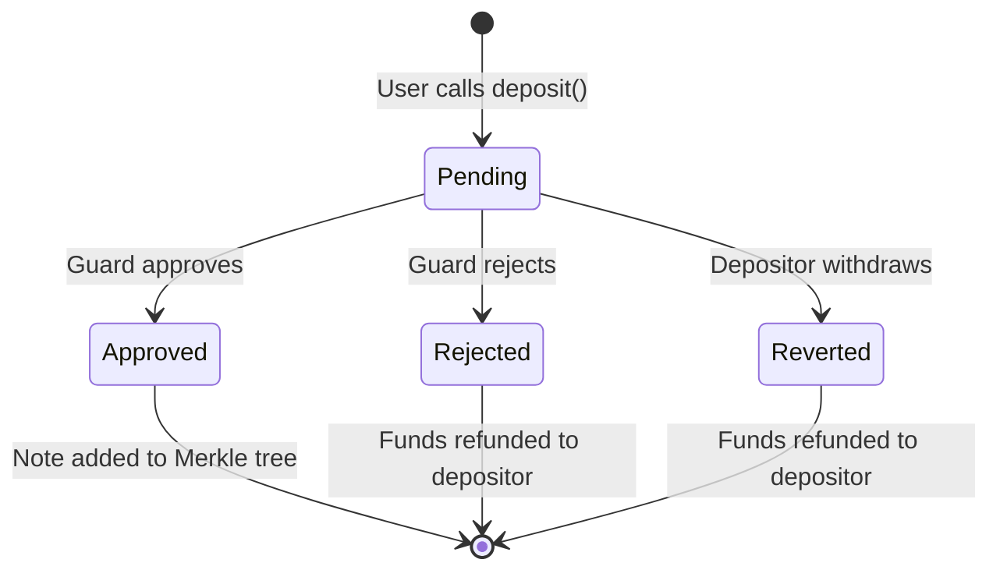

# Deposits

Deposits move funds from the user's wallet into the Nullmask privacy pool. All deposits require guard approval before the note is added to the Merkle tree.

## Deposit Functions

### `deposit(uint256 amount, address token)`

Deposit funds for `msg.sender`.

```solidity
function deposit(uint256 amount, address token) public payable returns (uint256)
```

* For ETH: `msg.value` must cover `amount` plus gas escrow
* For ERC-20: `msg.value` is the gas escrow; tokens are transferred via `safeTransferFrom`
* Returns the deposit index

### `depositTo(address recipient, uint256 amount, address token)`

Deposit funds for another address.

```solidity
function depositTo(address recipient, uint256 amount, address token)
    public payable nonReentrant returns (uint256)
```

Requirements:

* Recipient must have a registered receiving key
* Token must be whitelisted
* For ERC-20: supports fee-on-transfer tokens (uses balance delta)

### `registerReceivingKeyAndDeposit(uint256 amount, address token, ReceivingKey calldata rk)`

Convenience function that registers a receiving key and deposits in a single transaction.

### `receive()`

The contract's `receive` function auto-deposits received ETH, unless the sender is the Uniswap router (during swaps).

## Deposit Flow



1. User calls `deposit()` → funds are held by the contract
2. `DepositPending` event is emitted with deposit details
3. Guard service monitors for pending deposits
4. Guard screens the depositor address
5. Guard calls `approveDeposit()` or `rejectDeposit()`

## Guard Operations

### `approveDeposit(...)`

```solidity
function approveDeposit(
    uint256 index,
    address recipient,
    address token,
    uint256 amount,
    address depositor,
    uint256 gasEscrow,
    uint256 revocationPublicKeyX,
    uint256 revocationPublicKeyY,
    uint256 revocationPublicKeyHash
) external nonReentrant
```

Only callable by the guard. Validates the deposit data hash, computes the note commitment, adds it to the Merkle tree, and pays the gas escrow to the guard.

The revocation key is published with the deposit for compliance (see [Revocation Keys](/docs/compliance/revocation-keys)).

### `rejectDeposit(...)`

Refunds the deposited funds to the original depositor and pays the gas escrow to the guard.

### `withdrawPendingDeposit(...)`

Allows the original depositor to withdraw a pending deposit that hasn't been approved or rejected yet. Refunds both the deposit amount and gas escrow.

## Gas Escrow

Each deposit includes a gas escrow (ETH sent as `msg.value` beyond the deposit amount). This escrow:

* Pays for the guard's gas costs when approving or rejecting the deposit
* Is paid to the guard regardless of whether the deposit is approved or rejected
* Is refunded to the depositor if they withdraw the pending deposit

## Deposit Note Commitment

When a deposit is approved, the note commitment is computed as:

```rust
commitment = Poseidon2(
    Poseidon2(rk_hash, 0),                    // rk_commitment (trapdoor = 0)
    Poseidon2(amount, token, revocationKeyHash), // value_commitment
    depositIndex                               // unique value as nfs_hash
)
```

The deposit note ciphertext contains unencrypted fields (no ephemeral key exchange for deposits):

| Field | Value                                 |
| ----- | ------------------------------------- |
| 0-3   | Zero (no encryption header)           |
| 4     | `rk_hash` (receiving key hash)        |
| 5     | 0 (rk\_trapdoor)                      |
| 6     | `amount`                              |
| 7     | `token` address                       |
| 8     | `revocationKeyHash` (value\_trapdoor) |
